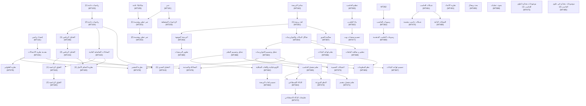

# Suez Canal University CS Degree Map

```mermaid
graph TD
    MT103["رياضيات عامة (1)<br>(MT103)"]
    MT104["رياضيات عامة (2)<br>(MT104)"]
    MT103 --> MT104
    MT131["إحصاء رياضي<br>(MT131)"]
    MT313["تحليل عددي 1<br>(MT313)"]
    MT101["جبر<br>(MT101)"]
    MT105["ميكانيكا عامة<br>(MT105)"]
    MT162["مبادئ البرمجة<br>(MT162)"]
    MT201["جبر خطي وهندسة (1)<br>(MT201)"]
    MT101 --> MT201
    MT105 --> MT201
    MT206["التحليل الرياضي (1)<br>(MT206)"]
    MT104 --> MT206
    MT231["مقدمة نظرية الاحتمالات<br>(MT231)"]
    MT131 --> MT231
    MT210["المعادلات التفاضلية العادية<br>(MT210)"]
    MT104 --> MT210
    MT261["لغة برمجة (1)<br>(MT261)"]
    MT162 --> MT261
    MT263["البرمجة الموجهة<br>(MT263)"]
    MT261 --> MT263
    MT202["جبر خطي وهندسة (2)<br>(MT202)"]
    MT201 --> MT202
    MT215["التحليل الرياضي (2)<br>(MT215)"]
    MT206 --> MT215
    MT203["الرياضيات المتقطعة<br>(MT203)"]
    MT101 --> MT203
    MT264["هياكل البيانات والخوارزميات<br>(MT264)"]
    MT261 --> MT264
    MT265["تنظيم الحاسب<br>(MT265)"]
    MT362["بناء الحاسب<br>(MT362)"]
    MT265 --> MT362
    MT363["رسومات الحاسب<br>(MT363)"]
    MT262 --> MT363
    MT364["تحليل وتصميم الخوارزميات<br>(MT364)"]
    MT264 --> MT364
    MT366["نظم قواعد البيانات<br>(MT366)"]
    MT264 --> MT366
    MT368["تحليل وتصميم النظم<br>(MT368)"]
    MT380["تطوير البرمجيات<br>(MT380)"]
    MT263 --> MT380
    MT365["نظم تشغيل الحاسب<br>(MT365)"]
    MT364 --> MT365
    MT367["تصميم قواعد البيانات<br>(MT367)"]
    MT366 --> MT367
    MT461["شبكات الحاسب<br>(MT461)"]
    MT464["الذكاء الإصطناعي<br>(MT464)"]
    MT365 --> MT464
    MT365 --> MT464
    MT401["نظرية الأعداد<br>(MT401)"]
    MT478["نظرية التشفير<br>(MT478)"]
    MT364 --> MT478
    MT231 --> MT478
    MT490["بحث ومقال<br>(MT490)"]
    MT313["التحليل العددي (1)<br>(MT313)"]
    MT210 --> MT313
    MT104 --> MT313
    MT319["الطرق الرياضية (1)<br>(MT319)"]
    MT210 --> MT319
    MT215 --> MT319
    MT369["تنظيم و معالجة الملفات<br>(MT369)"]
    MT264 --> MT369
    MT387["معالجة الصور<br>(MT387)"]
    MT261 --> MT387
    MT375["الشبكات العصبية<br>(MT375)"]
    MT364 --> MT375
    MT379["نظرية الطوابير<br>(MT379)"]
    MT231 --> MT379
    MT320["الطرق الرياضية (2)<br>(MT320)"]
    MT319 --> MT320
    MT388["بحوث عمليات<br>(MT388)"]
    MT462["الأوتوماتيكية واللغات الشكلية<br>(MT462)"]
    MT368 --> MT462
    MT476["المحاكاة والنمذجة<br>(MT476)"]
    MT364 --> MT476
    MT231 --> MT476
    MT465["نظم المعلومات<br>(MT465)"]
    MT368 --> MT465
    MT366 --> MT465
    MT477["تصميم صفحات ويب<br>(MT477)"]
    MT362 --> MT477
    MT473["النظم الموزعة<br>(MT473)"]
    MT365 --> MT473
    MT469["رسومات الحاسب المتقدمة<br>(MT469)"]
    MT363 --> MT469
    MT475["موضوعات مختارة لعلوم الحاسب (1)<br>(MT475)"]
    MT470["شبكات حاسب متقدمة<br>(MT470)"]
    MT461 --> MT470
    MT471["نظم تشغيل متقدم<br>(MT471)"]
    MT365 --> MT471
    MT480["الشبكات الذكية<br>(MT480)"]
    MT461 --> MT480
    MT463["تصميم لغات البرمجة<br>(MT463)"]
    MT462 --> MT463
    MT420["نظرية التحكم الأمثل (1)<br>(MT420)"]
    MT215 --> MT420
    MT210 --> MT420
    MT472["تطبيقات الذكاء الاصطناعي<br>(MT472)"]
    MT464 --> MT472
    MT485["موضوعات مختارة في علوم الحاسب (2)<br>(MT485)"]
```

